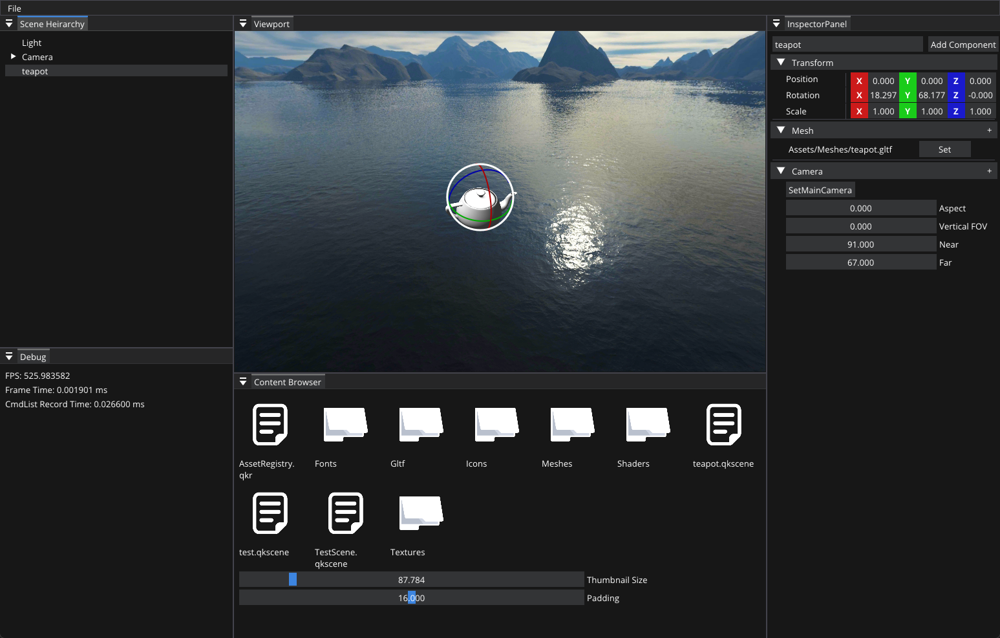

```
  ____     _    _       __       _____      _  ___
 / __ \   | |  | |      /\      |  __ \    | |/  /
| |  | |  | |  | |     /  \     | |__) |   | '  / 
| |  | |  | |  | |    / /\ \    |  _  /    |   <  
| |__| |  | |__| |   / ____ \   | | \ \    | .  \ 
 \___\_\   \____/   /_/    \_\  |_|  \_\   |_|\__\
                                     

                                                                
```


# Quark Game Engine

Quark is my personal learning project.


## Environment

- Windows, MacOS
- C++20( have been tested on MSVC and Clang)
- CMake 3.10+
- Vulkan 1.2+


## Build Editor
1. Make sure the "VULKAN_SDK" environment variable have been setted correctly
    - Go to https://www.lunarg.com/vulkan-sdk and download the vulkan sdk
2. ```git clone --recursive https://github.com/XieYHccc/Quark.git ```
3. ```cd Quark```
4. ```mkdir build```
5. ```cd build```
6. ```cmake ..```
7. ```make``` or open .sln
8. On windows you need to copy "Assets" and "BuildInResources" directories to the folder where Editor.exe exist.(Kinda ugly, will be imporved in the future)

## Feature

- Render Hardware Interface
- Vulkan Backend
- 3D Scene Renderer (Forward Renderer)
- Entity Component System
- Asset System
- Event System
- Job System
- UI with ImGui
- Scene Editor Tool
- KTX2 Transcoding

## Todo
- [x] Shader System
- [ ] Mouse Picking in Scene Editor
- [ ] Quark Customized Asset Format
  - [ ] Mesh
  - [ ] Texture
  - [ ] Material
- [ ] Skeleton Animation
- [ ] Render Graph System
- [ ] D3D12 Rendering Backend
- [ ] PBR Rendering
  - [ ] Directional Light
  - [ ] Point Light
  - [ ] Plane Light
- [ ] Scriping System
- [ ] Multithreading architecture (Rendering and Game Logitc)
- [ ] Dedicated Asset Loading thread
- [ ] Physics System
- [ ] Ray Tracing
- [ ] Bindless Model

## Current Editor Looklike
